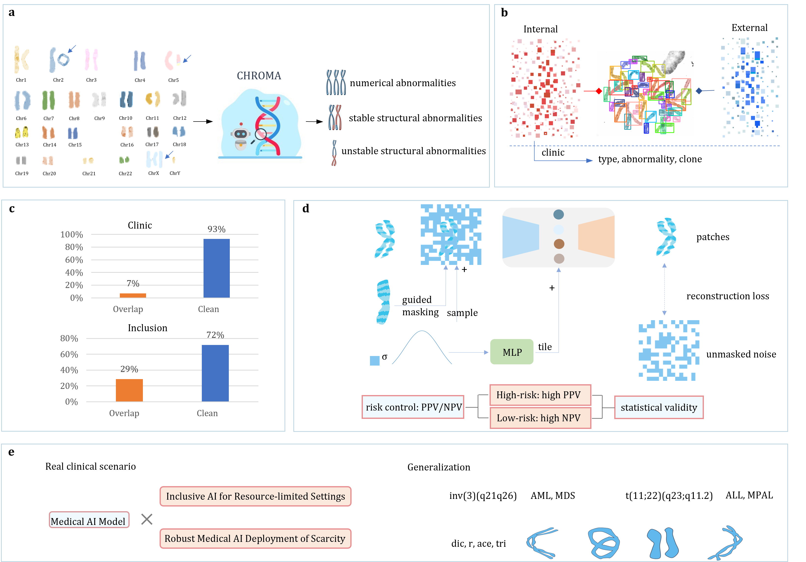

# CHROMA: An Inclusive Foundation Model for Generalizable Cytogenetics in Precision Oncology

[](LICENSE)
[](https://arxiv.org/abs/2505.15868)
[](https://huggingface.co/Boyoungc/CHROMA_pretrain/tree/main)

---



**CHROMA** is a large-scale foundation model for cytogenomics, pre-trained on 4 million+ chromosome images, enabling robust, generalizable detection of numerical and structural chromosomal abnormalities for precision oncology and genetics.

---

## 📝 Key Features

- Large-scale pretraining on 84,000+ specimens (~4 million images)
- Robust to noise, overlaps, and poor image quality
- Supports chromosome identification and abnormality detection
- Risk-control strategy for safe clinical deployment
- High label efficiency: achieves strong results with less annotation
- Open-source code and pre-trained weights

---

## 🎉 News

- 2025/07: Initial code and weights released!
- 2025/08: Released annotated benchmark datasets!

---

## 🔧 Installation

### Create Environment

```bash
git clone https://github.com/Changchun-Yang/CHROMA.git
cd CHROMA
pip install -r requirements.txt
```

---

## 🚀 Pre-trained Models

Model	Weights Link	Description

[CHROMA-pretrain](https://huggingface.co/Boyoungc/CHROMA/blob/main/CHROMA_pretrain.pth)

[CHROMA-numerical_abnormalities](https://huggingface.co/Boyoungc/CHROMA/blob/main/CHROMA-num_ab.pth)

CHROMA-stable_abnormalities：The CHROMA-stable_abnormalities models are fine-tuned per chromosome (up to 24 checkpoints). Due to their large storage size, please contact us if you require access to these files.

[CHROMA-unstable_abnormalities](https://huggingface.co/Boyoungc/CHROMA/blob/main/CHROMA-unsta_ab.pth)


---
## 🧑‍💻 Quick Start

```python
import torch
from models import models_vit

model = models_vit.__dict__[args.model](
    img_size=args.input_size,
    num_classes=args.nb_classes,
    drop_path_rate=args.drop_path,
    global_pool=args.global_pool,
)

checkpoint = torch.load(args.checkpoint_path, map_location='cpu')
checkpoint_model = checkpoint['model']
model.load_state_dict(checkpoint_model)

print("Model = %s" % str(model))

device = torch.device('cuda' if torch.cuda.is_available() else 'cpu')
model.to(device)

for i, (inputs, targets) in enumerate(your_data_loader):
    inputs, targets = inputs.to(device), targets.to(device)
    true_label=F.one_hot(targets.to(torch.int64), num_classes=args.nb_classes)
    outputs = model(inputs)
    prediction_softmax = torch.nn.Softmax(dim=1)(outputs)
    _,prediction_decode = torch.max(prediction_softmax, 1)
    _,true_label_decode = torch.max(true_label, 1)
```

---
## 🏋️‍♂️ Pretraining CHROMA from Scratch

To pretrain CHROMA on your own chromosome images, use the following command (example for 8 GPUs):

```python
torchrun --nproc_per_node=8 --master_port=48798 main_pretrain.py \
    --model cmae_vit_large_patch16 \
    --input_size 224 \
    --mask_ratio 0.5 \
    --mask_fg_ratio 0.75 \
    --lambda_bg 0 \
    --epochs 800 \
    --warmup_epochs 40 \
    --blr 1.5e-4 \
    --weight_decay 0.05 \
    --data_path '/ibex/project/c2277/data/Karyotype/pretrain_processed' \
    --norm_pix_loss \
    --batch_size 192 \
    --w_flip \
    --w_scale \
    --pad_color 255 \
    --distributed True
```
    
Adjust --data_path to your own pretraining data folder.

Change --nproc_per_node based on the number of GPUs you have.

---
## 🔬 Fine-tune for Identification & Numerical Abnormalities

To fine-tune a pretrained CHROMA model on your chromosome dataset for identification and numerical abnormality detection (24-class classification):

```python
torchrun --nproc_per_node=8 --master_port=48798 main_finetune.py \
    --batch_size 128 \
    --model vit_large_patch16 \
    --blr 5e-4 \
    --layer_decay 0.65 \
    --weight_decay 0.05 \
    --drop_path 0.2 \
    --nb_classes 24 \
    --data_path /ibex/project/c2277/data/Karyotype/class_abnormal/pretrain/cls_83w_split/ \
    --task ./finetune_chr_24_class/ \
    --finetune /ibex/user/yangc0h/xiaona/abnormal/chr_mae/output_dir/checkpoint-799.pth \
    --input_size 224 \
    --epochs 2 \
    --distributed True
```

Set --data_path to your identification dataset.

--finetune should point to the pretrained weights.

---
## 🧬 Fine-tune for Stable Structural Abnormalities

To further fine-tune the model for stable (binary) abnormality classification (e.g., normal vs. stable abnormal):

```python
torchrun main_finetune.py \
    --batch_size 128 \
    --model vit_large_patch16 \
    --blr 5e-4 \
    --layer_decay 0.65 \
    --weight_decay 0.05 \
    --drop_path 0.2 \
    --nb_classes 2 \
    --data_path ${DATA_PATH} \
    --task ${TASK_PATH} \
    --finetune /ibex/user/yangc0h/xiaona/abnormal/chr_mae/output_dir/checkpoint-799.pth \
    --input_size 224 \
    --epochs 30
```

Replace ${DATA_PATH} and ${TASK_PATH} with your own paths.

--nb_classes 2 for binary classification.

---
## 🧪 Fine-tune for Unstable Structural Abnormalities

To train or fine-tune your model on a dataset for unstable structural abnormalities (e.g., five-class classification):

```python
torchrun main_finetune_unsta_dist.py \
    --batch_size 128 \
    --model vit_large_patch16 \
    --blr 5e-4 \
    --layer_decay 0.65 \
    --weight_decay 0.05 \
    --drop_path 0.2 \
    --nb_classes 5 \
    --data_path ${DATA_PATH_5} \
    --task ${TASK_PATH_CHROMA_5} \
    --finetune /ibex/user/yangc0h/xiaona/abnormal/chr_mae/output_dir/checkpoint-799.pth \
    --input_size 224 \
    --seed ${seeds} \
    --epochs 30 \
    --w_pad
```

Replace ${DATA_PATH_5}, ${TASK_PATH_CHROMA_5}, and ${seeds} with your settings.

--nb_classes 5 for five-class classification (ace, dic, min, r, tri, etc.).

---
## 📄 Citation
If you use CHROMA, please cite:

```python
@article{yang2025inclusive,
  title={An Inclusive Foundation Model for Generalizable Cytogenetics in Precision Oncology},
  author={Yang, Changchun and Dai, Weiqian and Zhang, Yilan and Chen, Siyuan and Hu, Jingdong and Su, Junkai and Chen, Yuxuan and Xu, Ao and Li, Na and Gao, Xin and Yu, Yongguo},
  journal={Nature},
  year={2025}
}
```

---
## 📮 Contact
For questions or collaborations, please contact:

changchun.yang@kaust.edu.sa

---
## 📃 License
Distributed under the AGPL-3.0 License.
